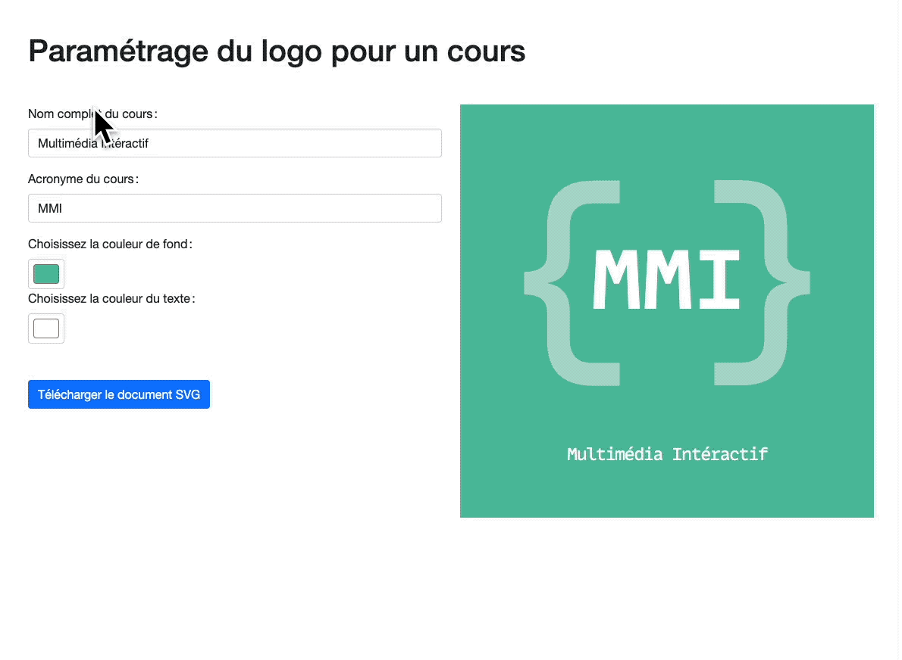

# Paramétrer un document SVG par TypeScript

> A JS exercise use at HEPL for MMI.

* * *

**mmi-produce-svg** is an educational project, which will be used for `JS` courses.

**Note:** the school where the course is given, the [HEPL](http://www.provincedeliege.be/hauteecole) from Liège, Belgium, is a French-speaking school. From this point, the instruction will be in French. Sorry.

* * *

Dans le cadre de cet exercice, nous vous demandons de programmer un mini générateur de logo avec JavaScript.

## Énoncé

1. Au chargement de la page, il faut peupler le formulaire avec les informations déjà existantes dans l'élément `svg#Logo` de référence. Plus précisément : 
   1. La couleur des textes;
   2. La couleur de fond;
   3. L’intitulé du cours;
   4. L'acronyme du cours.
2. Dès lors que l'on change une information dans un des champs du formulaire il est attendu que l'élément SVG se mette à jour afin d'offrir un aperçu des changements. Les accolades doivent avoir la même couleur que les textes. Nous avons déjà appliqué une opacité par CSS.
3. Quand on clique sur le bouton `#download`,  il faut mettre à jour l'attribut `href` en concaténant `data:image/svg+xml;base64,` avec le contenu de l'élément `svg#Logo` encodé en base 64. Vous pouvez vous inspirer de [ ce fil de discussion](https://stackoverflow.com/a/19885344/5714898). Le document téléchargé portera le nom de l'acronyme suivi de l’extension `.svg`. 

## Bonus 👏

* Écrire le code en TypeScript.

* Quand l'acronyme change de valeur, les accolades s'éloignent ou se rapprochent en fonction de la taille occupée par ce dernier. Dès lors que l'acronyme devient trop long, un bord rouge apparait sur l'élément `rect#background` qui représente le fond.

  []: 

  
